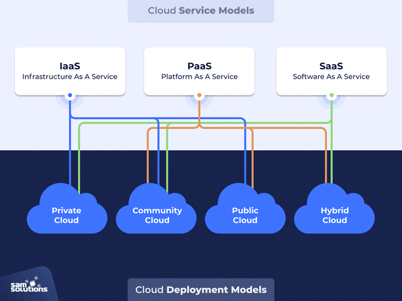

# Recherche zum Thema Cloud Computing
## Wie ist der Begriff Cloud entstanden? Wieso heisst es Cloud?
Der Begriff Cloud stammt aus dem Englischen, er bedeutet ins Deutsche übersetzt schlicht "Wolke". Die Wolke wurde in der Informationstechnik (genauer gesagt in Strukturzeichnungen von Netzwerken) zur Kennzeichnung von Systemen verwendet, die zwar Teil des eigenen Netzwerks waren, aber extern betrieben wurden.

## Wie wird der Begriff Cloud definiert, z.B. gemäss NIST
*"Cloud computing is a model for enabling ubiquitous, convenient, on-demand network access to a shared pool of configurable computing resources (e.g., networks, servers, storage, applications, and services) that can be rapidly provisioned and released with minimal management effort or service provider interaction."*
Übersetzt:
Netzwerk aus Computing-Ressourcen, wie Speicher, Server, Anwendungen und Dienste, das dem Nutzer über das Internet jederzeit und überall nach Bedarf zur Verfügung steht.

## Welches sind die 5 Merkmale einer Cloud?
+ On-Demand Self Service
Nutzer und Nutzerinnen können selbst die Bereitstellung von Ressourcen veranlassen

+ Broad Network Access
Das Netzwerk aus Ressourcen steht jederzeit und überall auf Abruf über alle möglichen Rechner, wie PCs, Laptops, Tablets und Smartphones zur Verfügung.

+ Resource Pooling
Die Ressourcen des Cloud-Speicher-Anbieters sind aus verschiedenen geographischen Orten zu einem virtuellen Ressourcen-Pool zusammengeschlossen. Nutzer und Nutzerinnen haben keine exakte Kontrolle, oder Wissen darüber.

+ Rapid Elasticity
Je nach Bedarf können schnell und einfach zusätzliche Ressourcen bereitgestellt, sowie nicht benötigte Ressourcen wieder freigegeben werden. Im Cloud Computing gibt es keine langen Vertragslaufzeiten.

+ Measured Service
Nutzer und Nutzerinnen bezahlen die bezogenen Ressourcen nach tatsächlichem Verbrauch. Bei einem Cloud-Speicherdienst bedeutet das, dass man auswählen kann, wie viel Speicher man benötigt und jederzeit ein Up- oder Downgrade durchführen kann.

## Welche Cloud Dienstleistungen kennen Sie?
Cloud Dienste sind die "as a Service"-Modelle. Dabei hätten wir **Software** as a Service (SaaS), **Plattform** as a Service (PaaS), **Infrastrucure** as a Service (IaaS) und als letztes **Anything** as a Service. (XaaS)

## Welche Cloud Anbieter kennen Sie?
Typische Cloud Anwendungen wären hier zum Beispiel Microsoft OneDrive, ICloud oder Dropbox. (Cloud Dienstleistungen)
Unter Anbietern verstehe ich eher Microsoft Azure, Google Cloud oder Amazon Web Services.

## Welche Cloud Deployment Modelle kennen Sie?

## Was sind Cloud Service Modelle?
Anscheinend ebenfalls Software as a Service, Plattform as a Service und Infrastructure as a Service.

## Weshalb soll ich Dienste aus der Cloud beziehen? Was sind die Vorteile?
Man kann so die Computerressourcen viel skalierter und kostengünstiger einsetzen. Man braucht dadurch nicht mehr 100 Server in einem Serverraum sondern kann ganz einfach die Cloudanbieter um Hilfe fragen, symbolisch ausgedrückt.

## Was sind die Nachteile?
Die grössten Nachteile sind die konstante Internetverbindung, welche Benötigt wird und die Abhängigkeit zum Cloud Anbieter.

## Welche Dienstleistungen werden in Ihrem Betrieb On-Premise (eigenes Rechenzentrum) betrieben?
Ein Teil der Infrastruktur wird in unserem Betrieb betrieben. Da kommen die Internetverbindungen her. Was es aber sonst genau damit auf sich hat, kann ich leider nicht sagen.

## Wie werden technologische Beiträge in der Cloud geteilt bzw. zur Verfügung gestellt?
Es gibt Hauptstellen wie AWS wo Technologien wie Load Balancer zb zur Verfügung gestellt werden.

