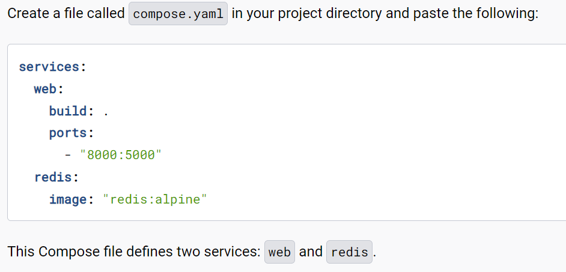
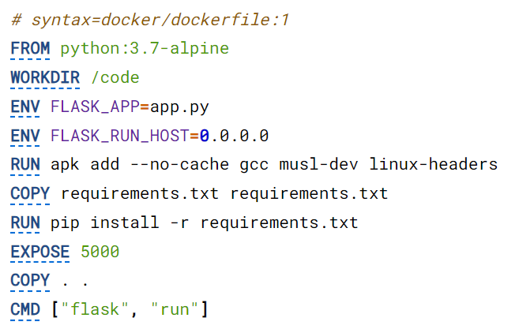

# Fragen
## Was ist Redis?
Redis ist ein Key Value Store, welches die Strings die man erzeugt speichert. -> High Memory Datenbank

## Welche Ports werden genutzt?
Einerseits der normale WebServer Port 8080 und dieses mal als zweites haben wir *Flask* was ein Webserver für Python Applikationen ist. Der Port für dieses Ding ist 5000.
Der Default **Redis** Port ist auf 6379

## Was ist die Bedeutung von ENV im DOCKERFILE?
Das sind Environment Variablen, die auf etwas im Programm verweisen. Sowas gibt es öfter Environment Variablen die auf Pfade verweisen, wo andere Komponenten eines Programms sind. Wie zum Beispiel eine dazugehörige Datenbank.
In unserem Fall hier, verweist die Environment Variable auf die Python App und auf den Port des Hostes.

