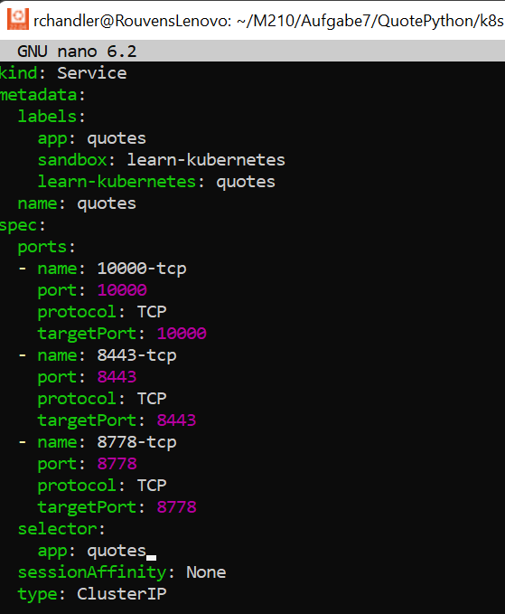

## What is the application doing?
Es nimmt per API Call immer ein Zitat und printet dieses auf der Webseite aus.

## Which programming language is used for the backend?
Im Backhand wird Python benutzt.

## Which programming language is used for the frontend?
Im Fronthand wird React verwendet.

--------------------------------------------------------------------------------------------------------------------

## To which resource type does the Route forward it's request to?
Die Routemap (route.yaml) legt fest welcher Server wie wo was erreicht wird. Zum Service.yaml.

## How does a Service know, to which Pod's it need to forward requests to?
Im Service.yaml File werden viele Dinge festgelegt, wie zb Ports. Der Service weiss über das untere Applabel "quotes" welcher sich durch die Files durchzieht, mit was er sich connecten muss.

--------------------------------------------------------------------------------------------------------------------

## Who creates the the requests to the Backend? The Frontend or the Browser?
Frontend creates requests to the Browser and the Browser creates requests to the Backend.

--------------------------------------------------------------------------------------------------------------------

## How does the backend know to which database it needs to connect?
Es connected zu der neuen Environment Variable die ich kreiert habe. DB_SERVICE_NAME
Der Inhalt dieser Umgebungsvariable ist der Name des Services. Der Datenbank bei diesem Beispiel. Der Podname anzugeben wäre verheerend, da der Pod beim restarten eine andere Zahlenfolge hinter dem "mysql" hat. 

--------------------------------------------------------------------------------------------------------------------

## What does a HPA do?
Also der Horizontal Auto Scaler, macht wie der Name schon sagt, eine horizontale Skalierung. Heisst wenn ein bestimmter CPU-Wert erreicht ist, wird ein zweiter Pod aufgestartet.

## Why can a HPA be useful?
Der HPA kann nützlich sein, weil so automatisch gecheckt wird, wenn eine Überlastung auftritt und deswegen sofort automatisch gehandelt werden kann. Man kann auch ein maximaler Wert eingeben, sodass nicht in den Himmel skaliert wird.

## What could be the risk of using a HPA?
Es kann Buganfällig sein. Wenn man etwas falsch konfiguriert und plötzlich mit 100 Instanzen dasteht, aber in mysql zb nur 50 Connections vorprogrammiert hat, kann das zum Absturz führen. Deswegen sollte man die Applikation immer erst testen bevor man sie einsetzt.
Es fügt komplexität hinzu.